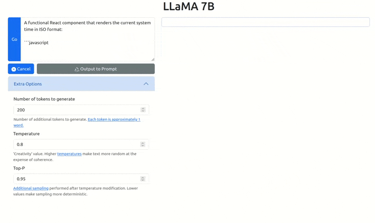

# LLaMA Frontend

This is a **non-production ready** frontend for [LLaMA](https://github.com/facebookresearch/llama). Do not expose this to the internet unless you are prepared to have random scanners instantly take control of your machine.

## Requirements

- Linux
- Cuda toolkit installed (supported versions up to 12.0.1 but *not* 12.1.x)
- Python 3.10+, pip
- NVidia GPU with 10GB+ of VRAM (8-bit inference courtesy of https://github.com/tloen/llama-int8)

## Setup

1. Clone this repo.
2. `pip install -r requirements.txt`
3. `pip install -e .`
4. Copy `7B` checkpoints folder and `tokenizer.model` to repository root.

## Running

`flask run` will start the app server on `127.0.0.1:5000`. Enable access from other devices on the network with `flask run --host 0.0.0.0`.

## Configuration

The checkpoint folder, tokenizer file, and other options can be configured with environment variables.

| Variable     | Description     | Default value |
|--------------|-----------|------------|
| CHECKPOINT_DIR | Path of 7B checkpoint folder      | `7B`        |
| TOKENIZER_PATH      | Path of tokenizer model  | `tokenizer.model`       |
| CONTEXT_LEN | Number of context tokens to provide to model. Reduce if you get cuBLAS or memory errors.  | `768` |
